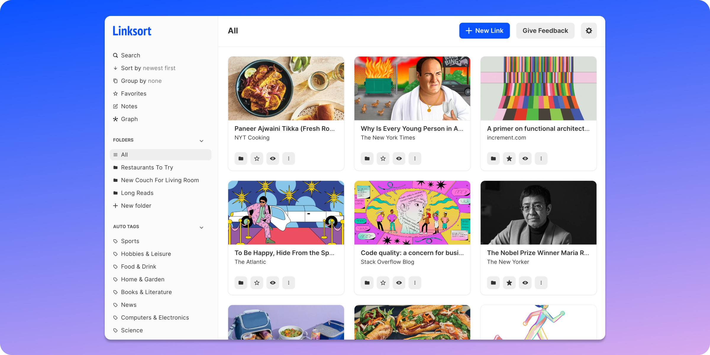

# Linksort

[](https://circleci.com/gh/linksort/linksort/tree/main) [](https://linksort.com/docs/index.html)



Linksort is an open source bookmarking application.

## Development

Setting up your development environment is easy. Make sure you have [`docker`](https://docs.docker.com/get-docker/) and [`docker-compose`](https://docs.docker.com/compose/install/) installed and run the following command from the root of this repository.

```bash
docker compose up
```

That's it! Go to [http://localhost:8000](http://localhost:8000) to find the app up and running. Whenever you change a file, the code we be automatically recompiled and run.

---

Sometimes you need to develop without being inside a Docker container. Follow these steps to run the project in development mode without Docker.

You'll need a access to a mongodb endpoint that supports replica sets. You can build and run a docker image that provides such an endpoint by running the following commands.

```bash
# Build the image.
docker build -f docker/mongo.Dockerfile -t mongo-rs .

# Run it in the background.
docker run -p 27017:27017 -v db-data:/data/db -d mongo-rs
```

Run [`air`](https://github.com/air-verse/air) to start the backend server. This also starts a watcher that automatically rebuilds and runs the server whenever changes are detected. You'll also need to set the following environment variables.

```bash
export PRODUCTION=0
export ANALYZER_KEY=$(cat /path/to/key)  # Optional
export DIFFBOT_TOKEN="<YOUR KEY>"
export ANTHROPIC_API_KEY="<YOUR KEY>"
export FRONTEND_HOSTNAME=localhost
export FRONTEND_PORT=3000
air
```

Open another terminal window and start the frontend. This server also starts a watcher that supports hot module replacement.

```bash
cd frontend
yarn start
```

Go to [http://localhost:8080](http://localhost:8080).

### Running Tests

```bash
# Build the mongo image.
docker build -f docker/mongo.Dockerfile -t mongo-rs .

# Run it. Note db-data2 and db2.
docker run -p 27017:27017 -v db-data2:/data/db2 -d mongo-rs

# Run tests. No need to repeat the previous steps for subsequent runs.
go test ./...
```

### Running in Prod Mode Locally

```bash
docker build -f ./docker/main.Dockerfile -t ls .
docker run -e ANALYZER_KEY="$ANALYZER_KEY" -e DB_CONNECTION="mongodb://172.17.0.2:27017/?connect=direct" -p 8080:8080 ls
```

### Generating API Docs

```bash
# Make sure swag is installed.
go install github.com/swaggo/swag/cmd/swag@latest

# Generate docs.
swag init --dir cmd/serve/,handler,model,payload
```
