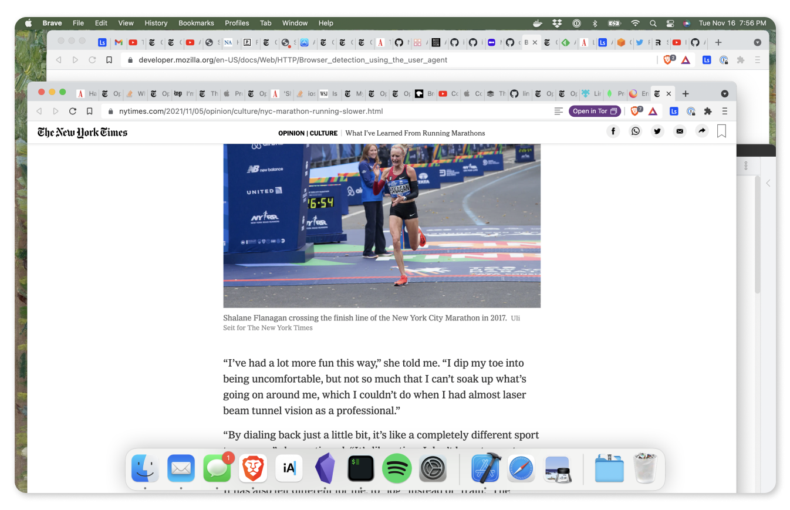

As the tagline says, I created Linksort to take back order in my browser and my brain. Before Linksort, every time I opened my laptop, I'd find about a half-dozen browser windows, each with a dozen or so tabs. The system I used was that each window roughly represented an ongoing project that I was working on. It wasn't the worst system, but I was annoyed by it enough to try to create something better.

When I was developing Linksort, I was finally able to close all of those tabs and browser windows. Now, I keep track of my links and their projects with Linksort's tools and, as a result, my mind feels clearer, less cluttered, and more at ease as I go about my work in a more intentional way.

The goal with Linksort is to get it to where it can organize all of my links for me, without my having to manually intervene. For example, I've recently been looking for a new apartment and so I've saved a bunch of links to different apartment listings. What I'd like is for Linksort to be smart enough to figure out that I'm looking for an apartment and to group those links together in a category called something like "New Apartment." The technology I've developed so far isn't there yet, but that's where I'd like it to go and I think it's plausible that it'll get there.

But who am I anyway? By day, I'm a senior software engineer at [AWS](https://aws.amazon.com), which I hope engenders at least a little confidence that Linksort is built in a safe, secure, and scalable way. On nights and weekends, I enjoy working on Linksort, playing guitar, running, drinking cocktails and cheap beer, and spending time with friends and family. You are welcome to follow me on [Twitter](https://twitter.com/AlexanderRichey) and [GitHub](https://github.com/AlexanderRichey), if you like.
