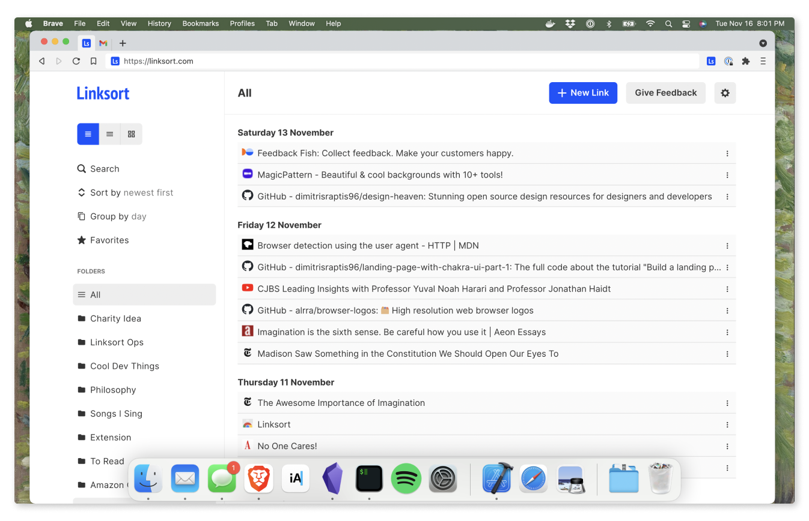

I decided to create Linksort to solve a few problems for myself. First, I wanted to remove the clutter of my browser windows and tabs, which made it hard for me to concentrate and to work effectively. Before I had a working prototype of Linksort, every time I opened my laptop, I'd find about a half-dozen browser windows, each with a dozen or so tabs. I wouldn't want to close any of my tabs, however, because each one would be related to some ongoing task at hand. The result was an ever ebbing and flowing stew of tabs that slowed my computer and my productivity.

A related problem was that I had no place to save interesting content I found online. Among my numerous tabs, I'd have interesting articles, YouTube videos, GIFs, memes, and other things that I didn't really want to forget about, but which I had no place to put. Eventually, I'd close these tabs out of frustration or an effort to tidy up, but later I'd often find myself looking up the same bits of information when again they were relevant a week or so later.

After I developed a working prototype of Linksort, both of these problems went away. I was able to impose some order over my browser windows and tabs by saving them to Linksort and by finally closing them. This not only freed up capacity on my computer; it also seemed to free up capacity in my own mind, by making it easier for me to go about my work in a more intentional way. For anything interesting I find online, I now save it to Linksort, where it is automatically categorized and made searchable. 

You might wonder why went to the trouble of building Linksort [from scratch](https://github.com/linksort/linksort) instead of just using [Pocket](https://getpocket.com) or [Raindrop](https://raindrop.io) or any of the other existing solutions. I described my reasoning in [an earlier post](/blog/idea). The gist is that, for different reasons, none of the available options does everything I'd like my bookmarks manager to do. And I also don't like their designs.

Going forward, one goal with Linksort is to get it to where it can organize all of my links for me, without my having to manually intervene. For example, I've recently been looking for a new apartment and so I've saved a bunch of links to different apartment listings. What I'd like is for Linksort to be smart enough to figure out that I'm looking for an apartment and to group those links together in a category called something like "New Apartment," all on its own. The technology I've developed so far isn't there yet, but that's where I'd like it to go and I think it's plausible that it'll get there.

Other goals include continuing to make Linksort more usable, more beautiful, and a bit more feature rich.

But who am I anyway? By day, I'm a senior software engineer at [AWS](https://aws.amazon.com), which I hope engenders at least a little confidence that Linksort is built in a safe, secure, and scalable way. On nights and weekends, I enjoy working on Linksort, playing guitar, running, drinking cocktails and cheap beer, and spending time with friends and family. You are welcome to follow me on [Twitter](https://twitter.com/AlexanderRichey) and [GitHub](https://github.com/AlexanderRichey), if you like.
