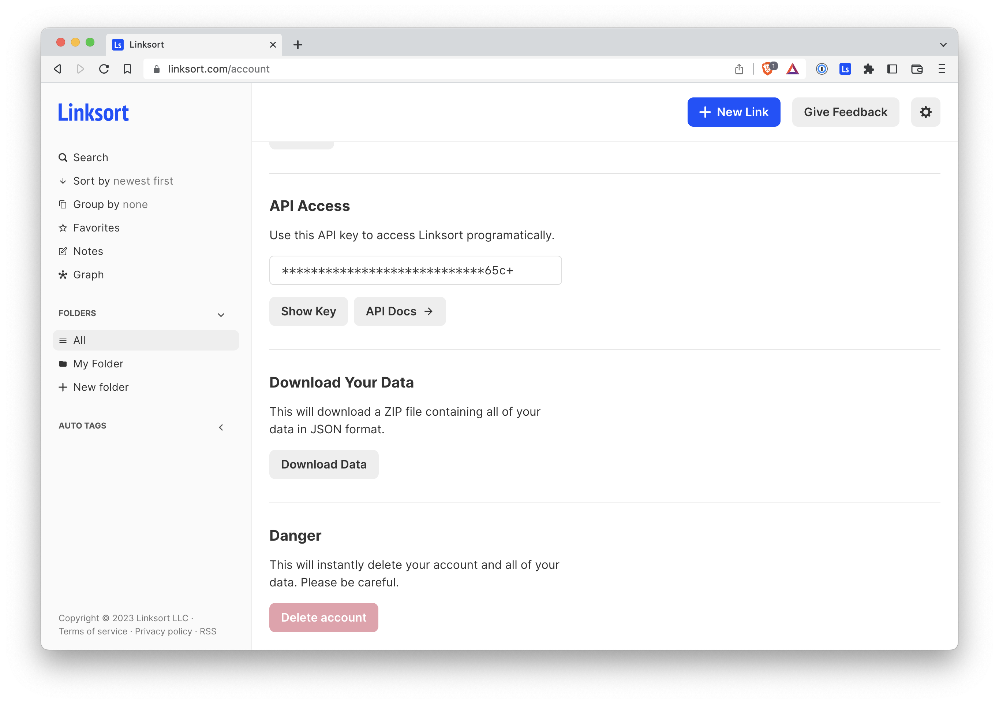

A few things have been updated lately.

- **Public API:** There is now a publicly available Linksort API. See [the documentation](https://linksort.com/docs/index.html) to get started and retrieve your API key from your [account settings page](https://linksort.com/account).
- **Download Your Data:** On your [account settings page](https://linksort.com/account), you'll also notice that you can download all your data in a nice little ZIP file.
- **Visual Tweaks:** Linksort's UI has been adjusted a bit. The sidebar now sticks to the left side of the window and has been refreshed a bit, with a grey background and smaller icons, which looks a little more elegant to me.

Thanks for using Linksort!

