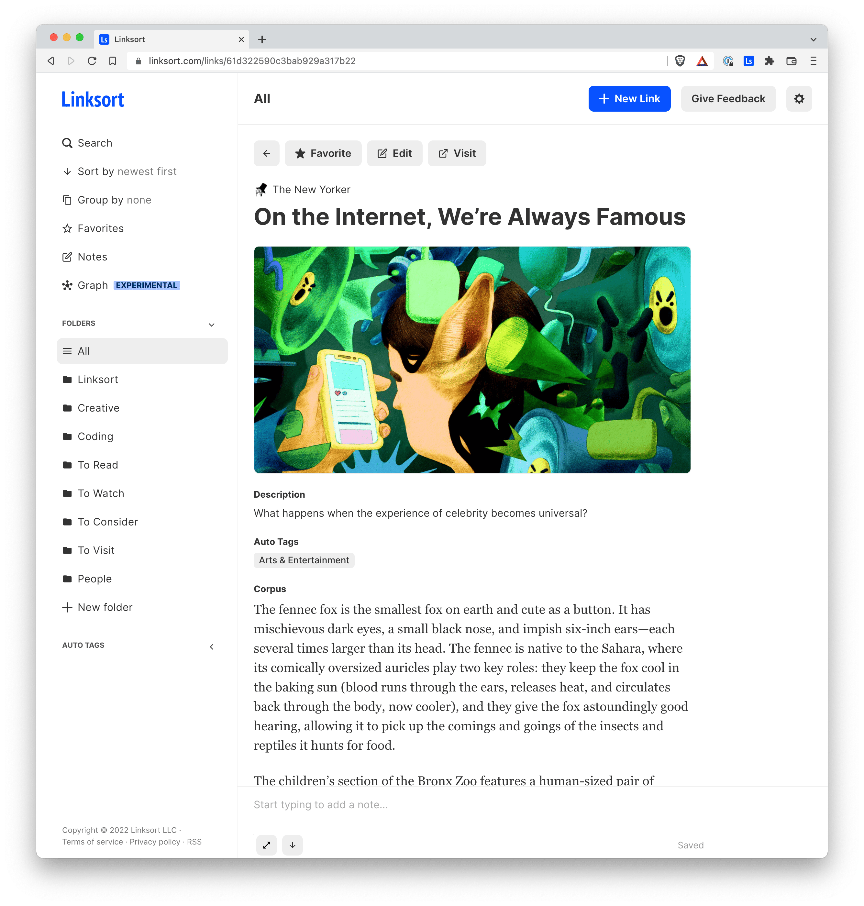
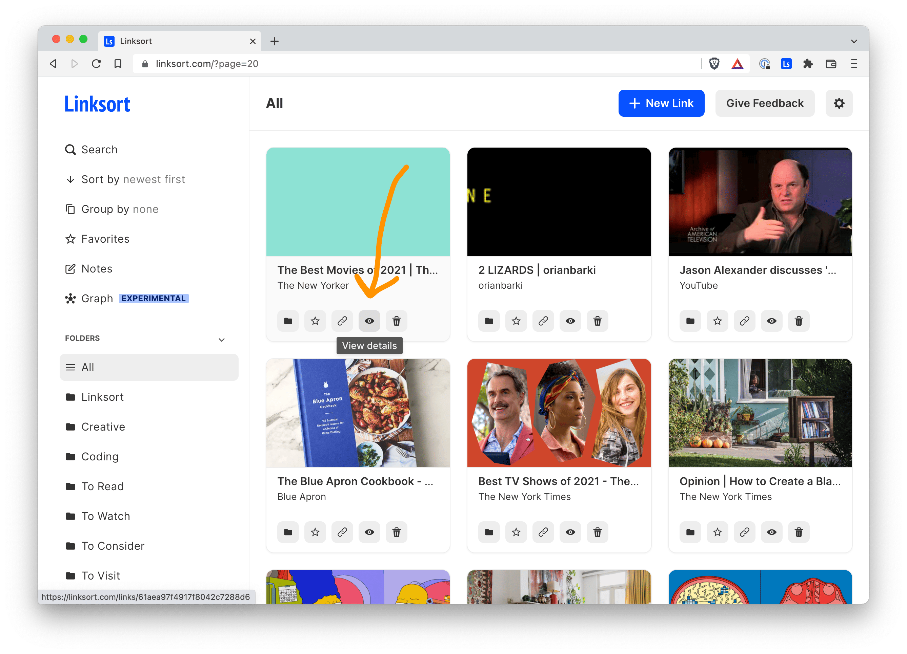
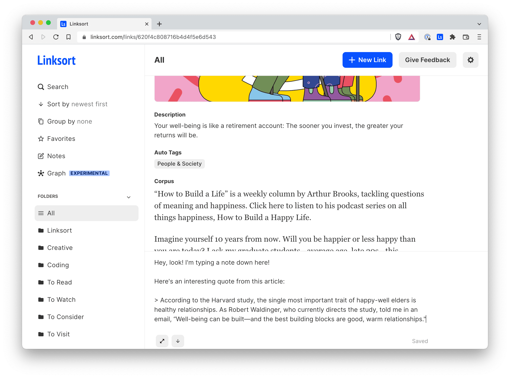

Linksort now has a beautiful new reader view that displays articles you've saved in a clean, clutter free view. It's powered by [go-readability](https://github.com/dyatlov/go-readability), a library based on the [same algorithm](https://github.com/mozilla/readability) that Firefox uses for its readable webpage view. In my experience, it works quite well on most websites.

To get to reader view, click the "View details" icon that looks like an eye.

Additionally, you can now add notes to links. This can be useful when doing research or when you simply want to jot down a reaction to an article or other consideration. You can toggle the notes filter in the sidebar to only show links on which you've added notes.
