To have the best experience with the Safai extension, there is some additional setup after installation.

- First, <a href="https://apps.apple.com/app/save-to-linksort/id1595764443" target="_blank">**install the extension from the App Store**</a>.
- Next, follow instructions for [**Desktop**](#Desktop) or [**Mobile**](#Mobile) (iPhone & iPad).

<h2 id="Desktop">Desktop</h2>

Open Safari and press `Command + ,` to open Safari's settings. Choose **Extensions** among the options on the top nav bar, and then make sure Linksort is checked.

Choose **Always Allow on Every Website...** If you don't do this, you'll get a pop-up everytime you try to save a link asking if you want to give Linksort permission, which would be annoying.

Choose **Always Allow on Every Website** to confirm. The only thing the extension reads is the URL of the site you want to save and its title and favicon image, if available.

Next, go ahead and choose **Preferences** under Linksort.

This will open up your extension's options page, where you'll have to sign into Linksort with your email and password.

After your done, the page should look like this:

Close the options page and **you're done**. You can now click the Linksort button in the browser's toolbar to save links as your browse.

<h2 id="Mobile">Mobile</h2>

Open the **Settings** app.

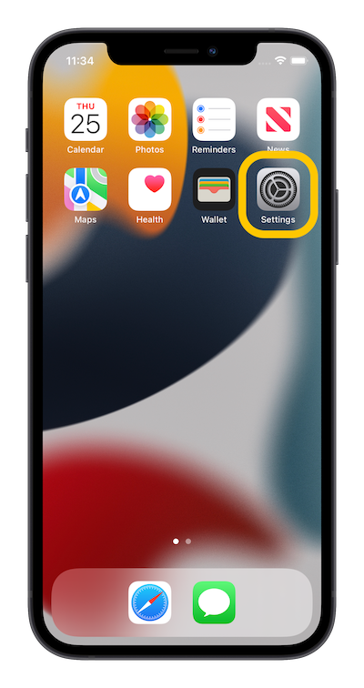

Under Settings, Choose **Safari**.

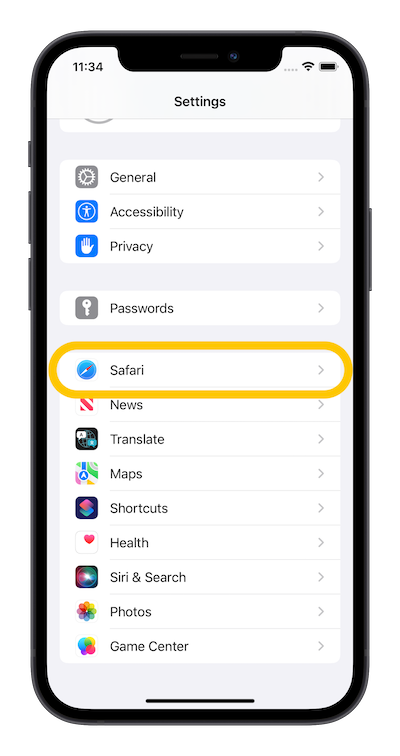

Under Safai's settings, choose **Extensions**.

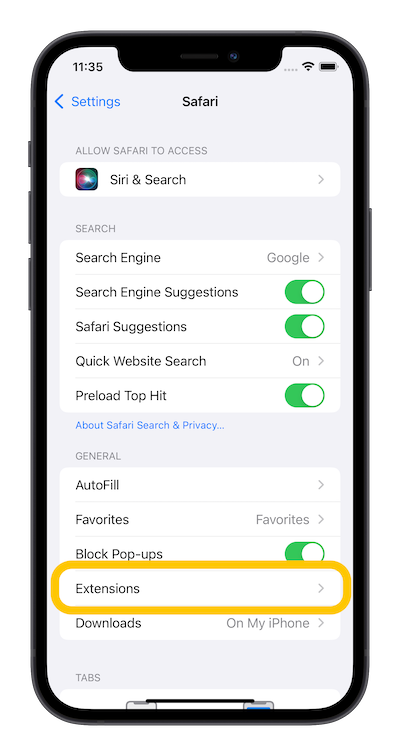

Under extensions, choose **Linksort**.

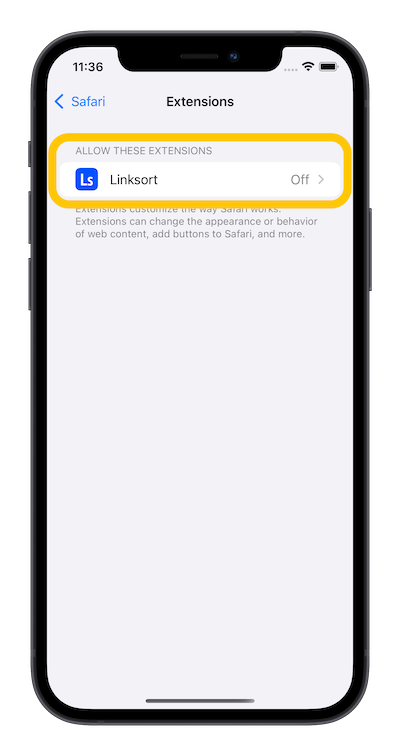

Make sure the extension is **enabled**.

Next, under the permissions section, make sure that *linksort.com* and *Other websites* are set to **Allow**.

The only thing the extension reads is the URL of the site you want to save and its title and favicon image.

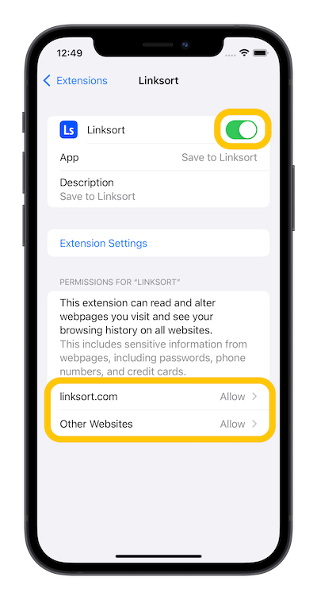

Now choose **Extension Settings**. This will open a new tab in Safari.

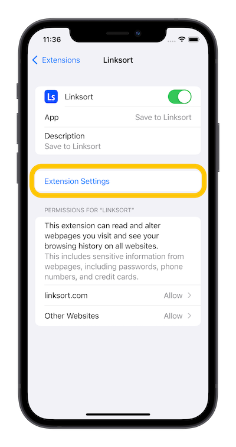

Sign into Linksort with your email address and password.

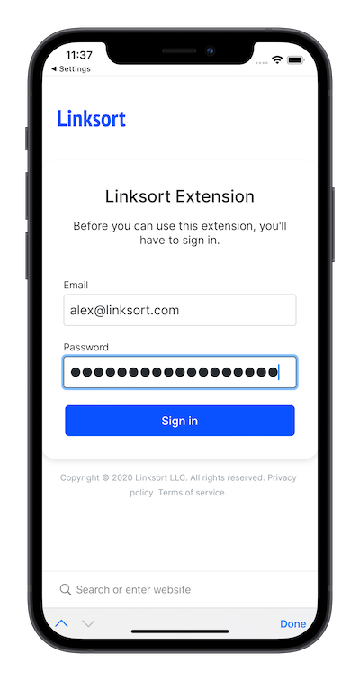

When you're done, it should look like this:

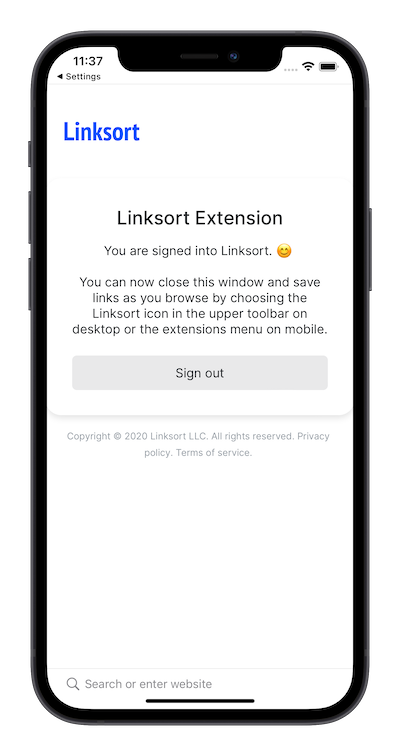

Now you're ready to use the extension. When you want to save a link, choose the **puzzle-piece icon** in the URL bar.

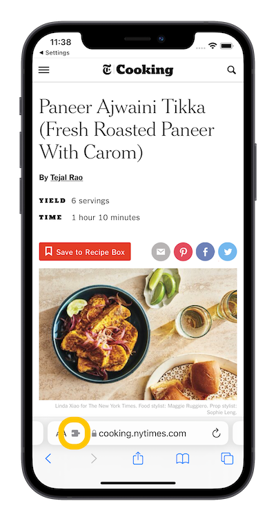

Choose **Linksort**.

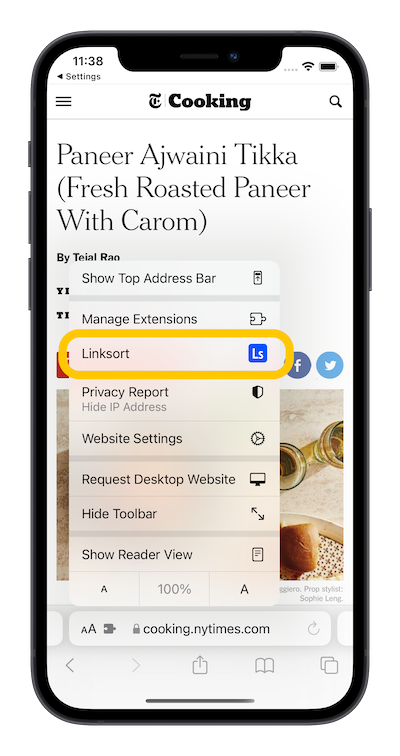

And you link is saved!

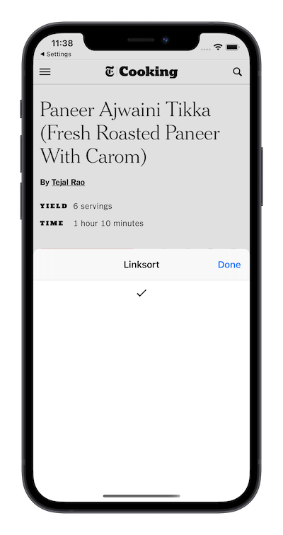

